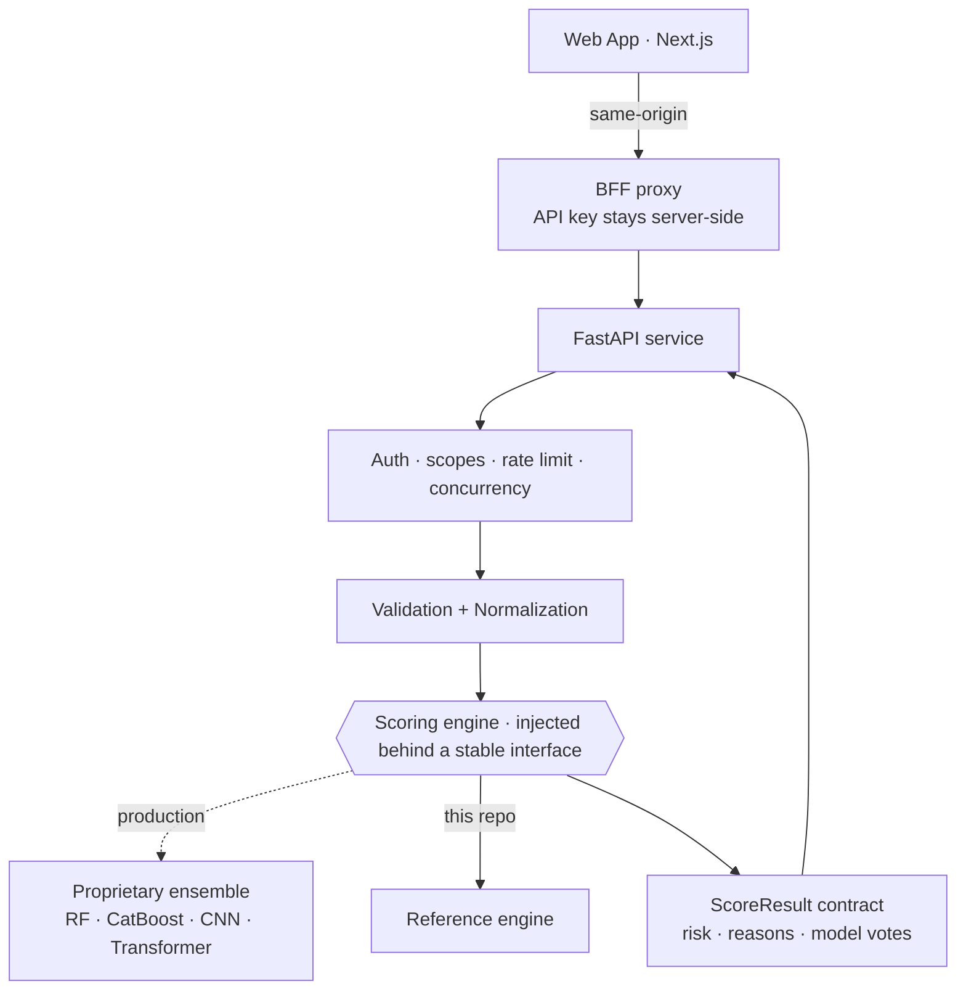

<div align="center">

# 🛡️ LIMENX — Engineering Showcase

### Offline, explainable, URL-only phishing detection

*A curated look at how LIMENX is engineered — architecture, API, security, and frontend.*


</div>

> ### ⚠️ This repository is an engineering showcase, not the full production implementation.
>
> It contains the **real** application, API, security, validation, and frontend code from
> LIMENX. The **proprietary detection engine** — the 63-signal feature extractor, the four
> trained models, the calibrated fusion, and the SHAP explanation engine — is **not
> included**. In its place, `engine/` ships a documented **reference implementation of the
> same interface**, so everything here runs end-to-end.
>
> **This is not a phishing detector.** It is a demonstration of how one is engineered.

---

## What is LIMENX?

**LIMENX** analyses a URL and decides whether it's phishing — using **only the URL text**,
fully offline, never fetching the page (no SSRF). Its distinguishing feature is that every
verdict ships with a **faithful explanation**: a risk score, the reasons that produced it,
and how each model in the ensemble voted.

In production it runs a **four-model ensemble** (Random Forest · CatBoost · Character CNN ·
Character Transformer) behind a calibrated fusion layer, served by the FastAPI application
you can read in this repository.

## Why this repository exists

LIMENX is a commercial product, so the detection engine stays private. But the *engineering*
around it — how the system is layered, how the API is secured, how failures are contained,
how it's tested — is what I actually want to show. So this repo publishes those layers
**as real, running code** rather than as slideware.

## 🏗️ Architecture



The engine is **injected behind a stable contract**. That's the seam the whole architecture
is built around — and it's why this showcase can swap the proprietary detector for a
reference one without touching a single layer above it.

📖 **[Full architecture write-up →](docs/ARCHITECTURE.md)**

## ✅ What's included (real production code)

| Layer | What it demonstrates |
|---|---|
| **`api/`** | FastAPI service: salted-hash API keys w/ constant-time verification, scoped authorization, token-bucket rate limiting, concurrency load-shedding, request-ID/correlation middleware, body-size + timeout caps, structured logging, Prometheus metrics, env-driven config |
| **`core/`** | URL normalization and parsing utilities |
| **`validation/`** | URL + feature-vector validation (fail-closed) |
| **`models/`** | The model **interfaces**: capability-based `BaseModel`, `ModelManager`, view contracts |
| **`engine/`** | The scoring seam + the `ScoreResult` output contract + a reference engine |
| **`web/`** | Next.js 16 frontend: BFF proxy pattern, typed API layer, scanner UI, tests |
| **`tests/`** | 70 tests covering the API contract, auth, middleware, interfaces, validation |

## 🔒 What's deliberately excluded

The feature-extraction engine · trained models & weights · ensemble fusion · probability
calibration · the SHAP explanation engine · training/evaluation pipelines · datasets.

See **[`NOTICE`](NOTICE)** for the full terms.

## 🚀 Run it

It really runs — the reference engine makes the whole stack functional.

```bash
# Backend
pip install -r requirements.txt
uvicorn api.main:app --port 8000

# Frontend (separate terminal)
cd web && npm install && npm run dev     # http://localhost:3000
```

Score a URL:
```bash
curl -s -X POST http://127.0.0.1:8000/v1/predict \
  -H 'content-type: application/json' \
  -d '{"url":"http://secure-login-verify.tk/account","include_explanation":true}'
```

Run the tests:
```bash
pytest -q        # 70 passing
```

## 🧰 Tech stack

**Backend** Python 3.14 · FastAPI · Pydantic · Uvicorn · Prometheus
**Frontend** Next.js 16 (App Router) · React 19 · TypeScript · Tailwind v4
**Production engine (private)** scikit-learn · CatBoost · PyTorch · SHAP

## 🧭 Engineering principles

Clean architecture with strict layer boundaries · SOLID · capability-based interfaces over
`isinstance` checks · composition roots for wiring · **fail-closed** on scoring and
validation, **fail-open** on explanation (a degraded explanation never breaks a verdict) ·
type hints throughout · documented trade-offs, including the honest ones.

---

<div align="center">

**© 2026 Youssef Ismail. All rights reserved. LIMENX is proprietary software.**
Published for portfolio review — not licensed for reuse. See [`NOTICE`](NOTICE).

[GitHub](https://github.com/youssefismail-dev) · [X](https://x.com/YoussefIsmail39) · [Kaggle](https://www.kaggle.com/youssefismail396)

</div>
